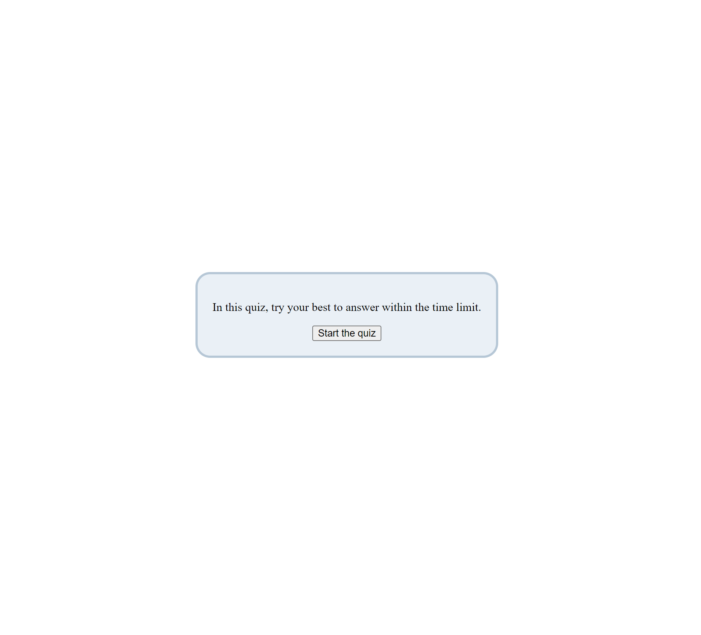

# Quiz-app

[link](cckinwest.github.io/Quiz-app/index.html)

## Purpose

This application gives a quiz with 10 MC questions in various topics. The questions of the quiz are downloaded using the Trivia api. The quiz takes 45 seconds, when the quiz ends, players can submit their names and their results will be recorded and displayed in a scoreboard.

## The parts of the application

The application is splited into four pages: index.html, game.html, submit.html, and scoreboard.html. Each of the pages is empowered by its own javascript file.

### Index

This is the starting page of the app. It consists of a start button and a message on the top of the button. When the start button is pressed, questions will be fetched through the api. During the fetch of questions, the message will become a loading message. When the fetch completed, the game.html will be loaded. The questions loaded will be stored in the browser using localStorage temporarily.

### Game

It is the main part of the app. A question bank will be loaded using the localStorage. It will be transformed into MC questions. A question card will be used to display the text and the options of each question. When the first question is loaded, a timer will start to count from 45 seconds. To answer each question, a button for each option is pressed. When the correct answer is chosen, a '✔' will be displayed next to the option; otherwise, a '✖' will be displayed. Then next question will be rendered until all the 10 questions are answered or time is up. When the game ends, the submit.html will be loaded. Score and the highest score will be uploaded through localStorage.

## Submit

It has a message telling the scores, a textfield for entering the name, a button to submit the result. When the player does not enter the name and submits, the name will become 'Guest'. The previous records are pulled using the localStorage first. When a new individual record is submited, it will be appended at the end of the records. The new records will be stored with the localStorage again. If the player does not want to submit the score, the button "no Submit" can be pressed and go straight to the final page of scoreboard.html.

## Scoreboard

It consists of a table showing the records and a button to clear the records. New row will be generated for each individual record. There is also a button for going back to the index.html

